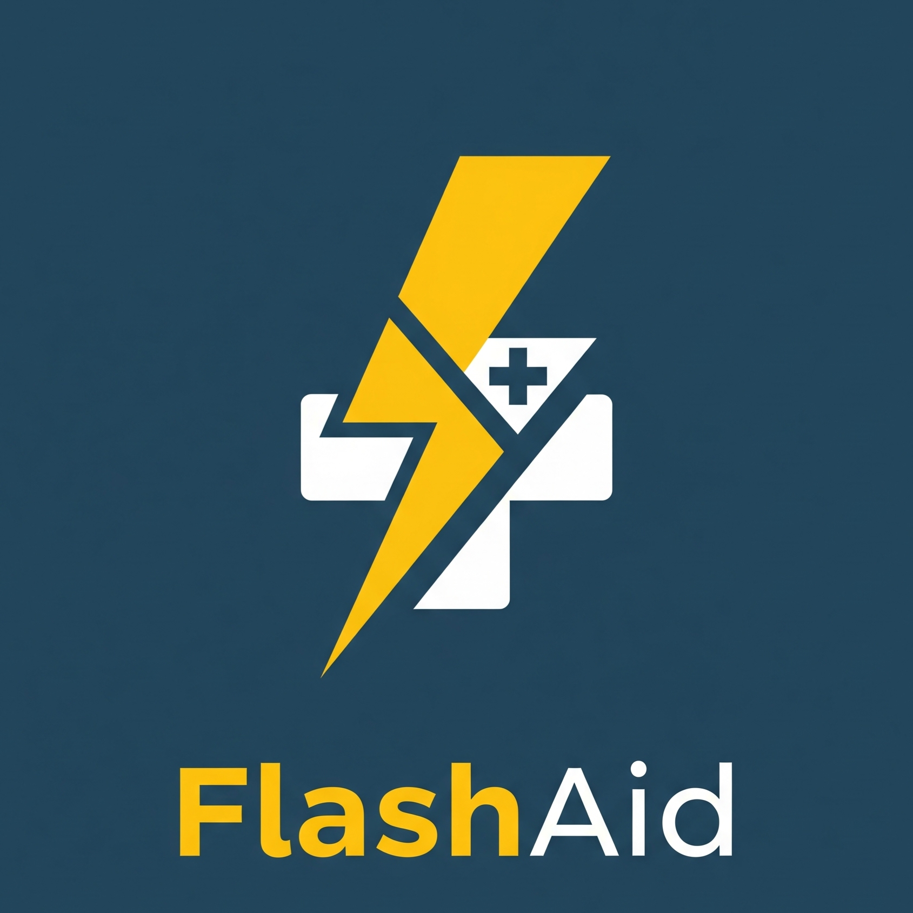
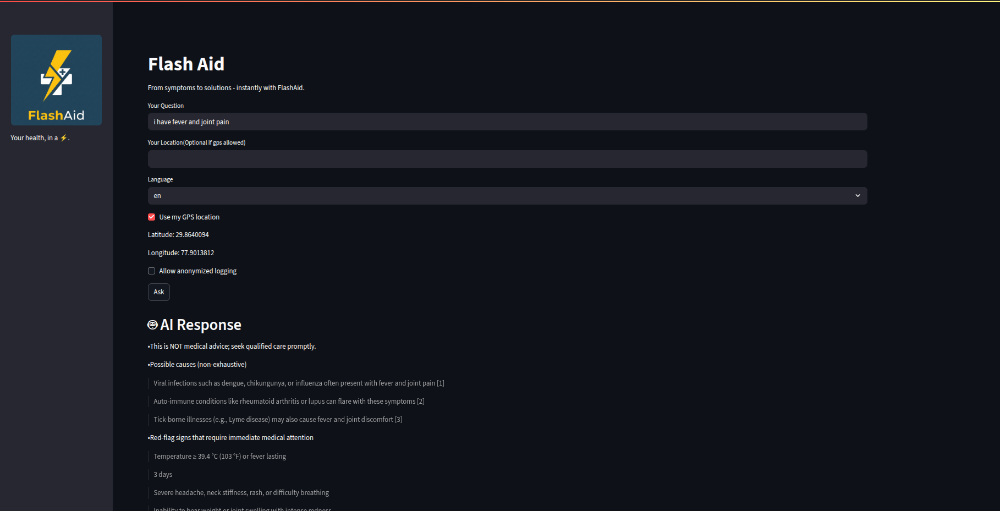
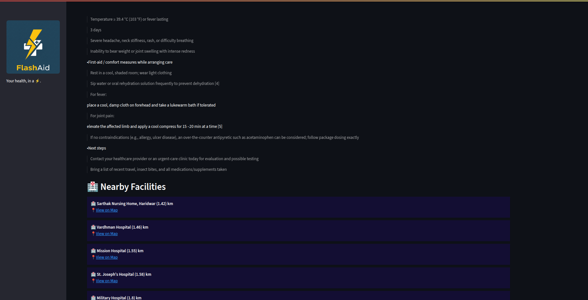

<p align="center">
  
</p>

<h1 align="center">🩺 Flash Aid</h1>
<p align="center">
Multilingual AI triage assistant with local facility lookup using TiDB Vector Search
</p>

---

## ❓ Problem Statement
Millions of people in underserved areas lack:
- Accessible medical guidance in **local languages**  
- Information about **nearby hospitals and clinics**  

👉 **AI Health Navigator** bridges this gap with instant AI-driven health navigation + facility lookup.

---

## 🏗️ Architecture
User → Streamlit UI → FastAPI Agent → TiDB Vector Search → LLM → Translation → Facility Lookup (Overpass API) → Streamlit (streamed answer)


---

## ⚡ Tech Stack


- **Frontend:** Streamlit  
- **Backend:** FastAPI  
- **Vector DB:** TiDB Vector Search  
- **Maps / Facilities:** OpenStreetMap + Overpass API + Geopy  
- **AI/LLM:** OpenAI (for reasoning + multilingual support)  
---
## 🔍 Why TiDB Vector Search?

AI Health Navigator uses **TiDB Vector Search** to power retrieval-augmented generation (RAG) for medical knowledge.  

- 📚 **Medical Knowledge Base**  
  Retrieves structured medical guidelines (e.g., WHO, CDC, government advisories) for more reliable answers.  

- ⚡ **Semantic Search with Low Latency**  
  Embeddings enable AI to understand queries like *“fever + joint pain”* and match them with relevant medical information quickly.  

- 📈 **Future-Proof & Scalable**  
  TiDB can scale seamlessly to handle more documents, languages, and regional datasets as the project grows.  
---
## ⚙️ Installation

Clone the repository:

```bash
git clone https://github.com/13armaan/Flash_Aid.git
cd Flash_Aid

#Backend Setup(FastAPI)
cd backend
pip install -r requirements.txt
uvicorn main:app --reload

#Frontend Setup(Streamlit)
cd frontend
cd ui
pip install -r requirements.txt
streamlit run app.py
```
---
##▶️ Usage Instructions

Open the [Homepage]

Enter your symptoms or query.

The AI will:

    -Analyze inputs

    -Suggest possible conditions

    -Provide citation-backed responses

    -Recommend nearby healthcare facilities (if integrated).

---
## 💡 Sample Query

**Input:**  
`I have fever and joint pain in Delhi`  

**AI Output:**  
-The Ai tool will provide with the advice related to the query by the user.
Includes:-
-Answer 
-First aid steps
-Nearby Facilities
-citations





---
## Author
👤 **Armaan Sharma** 
* Github: [@13armaan](https://github.com/13armaan) 
* LinkedIn: [@armaan-sharma-756602351](https://linkedin.com/in/armaan-sharma-756602351)

---
## Show your support 
Give a ⭐️ if this project helped you! 
---
## 📝 License 
Copyright © 2025 [Armaan Sharma](https://github.com/13armaan)
This project is [Apache 2.0](http://www.apache.org/licenses/LICENSE-2.0) licensed.


